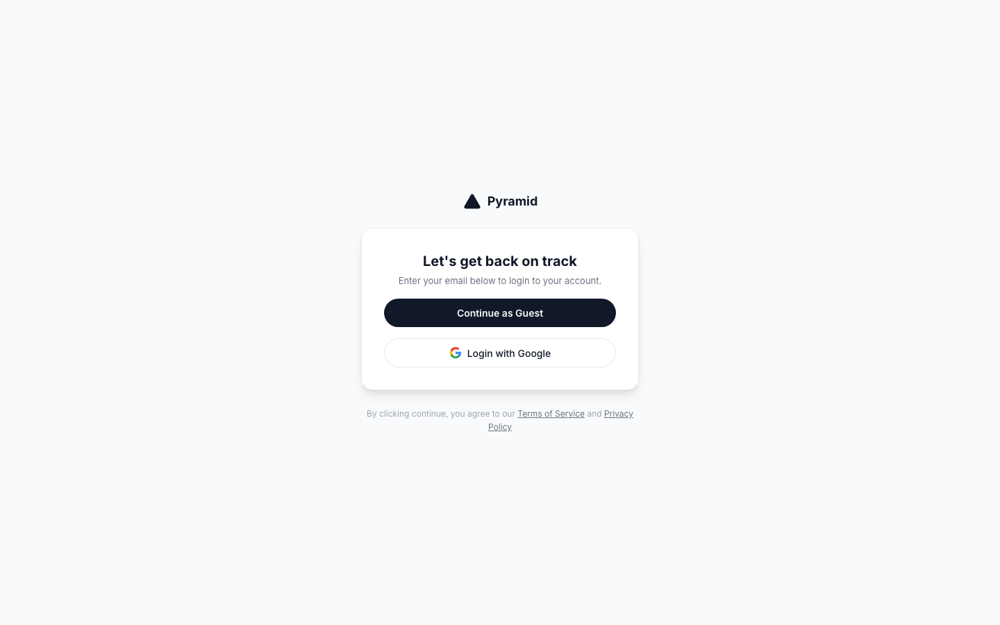
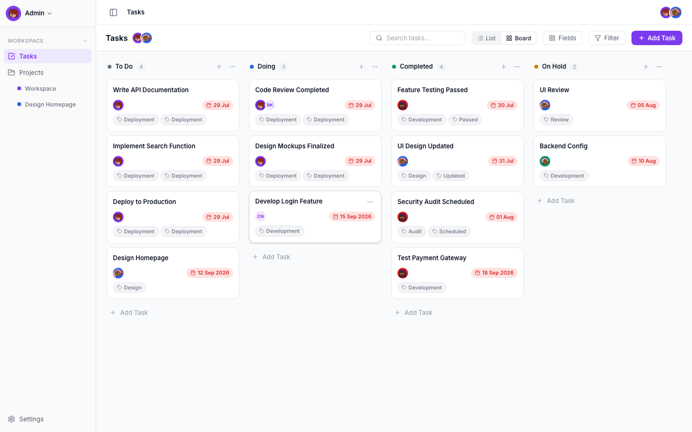
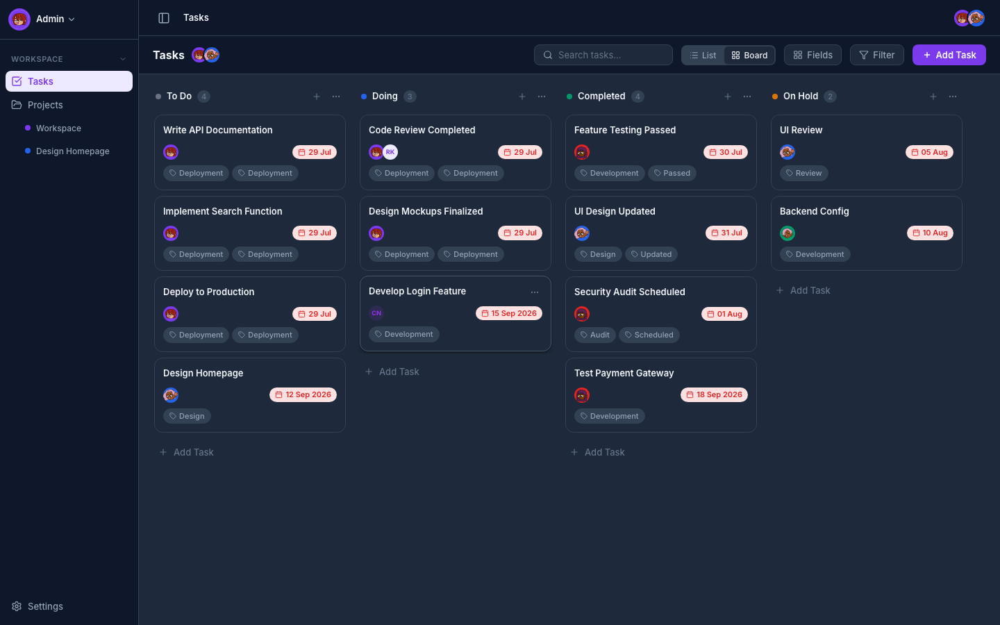
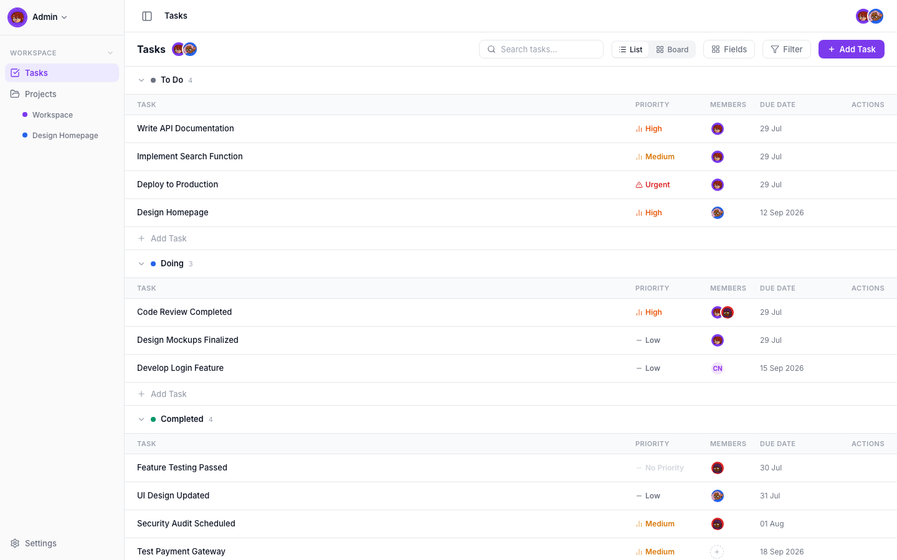

# Pyramid - App Walkthrough

Welcome to the walkthrough of Pyramid Task Manager! This document showcases the core UI features of the application built during the AbleSpace Full Stack assignment.

## 1. Login Page
The application features a clean, Notion-style minimalist login page with guest access for easy evaluation.

## 2. Kanban Board (Light Theme)
The core dashboard features a drag-and-drop Kanban board. It supports inline editing, colored labels, due dates, and a beautiful flat design.

## 3. Kanban Board (Dark Theme - Emerald)
The application includes a fully responsive dark mode with 6 interchangeable accent colors. Here is the board in Dark Mode with the Emerald accent.

## 4. List View
Users can toggle between Board and List views seamlessly. The List view groups tasks by status in a clean data table format.

